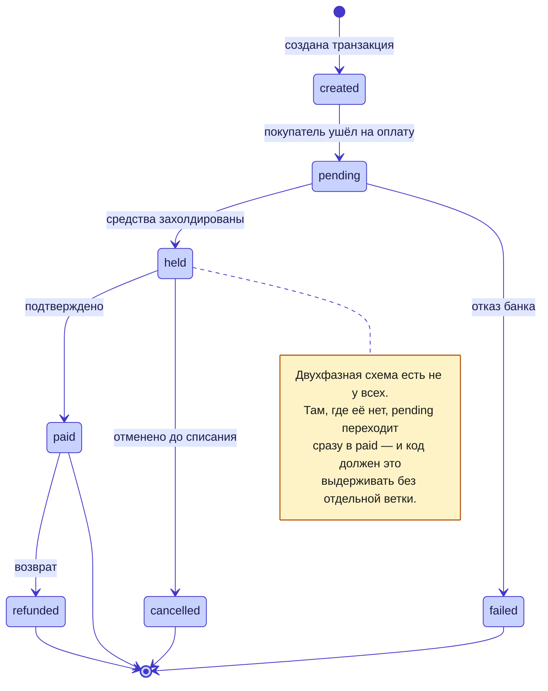
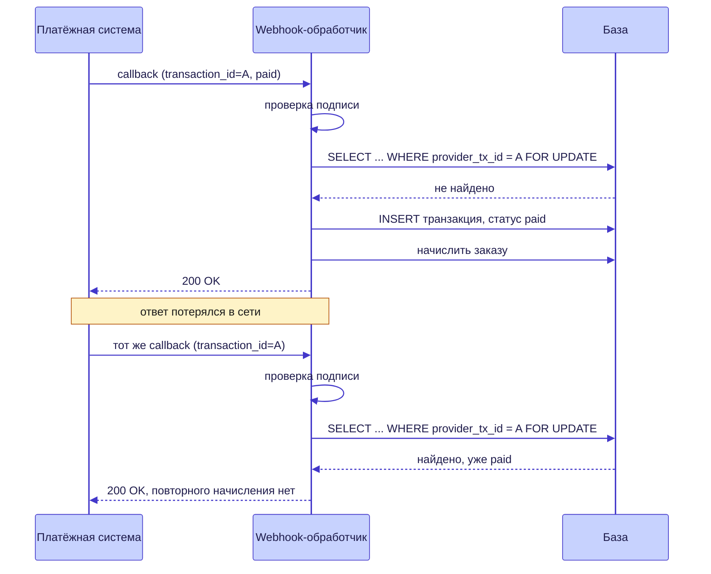

<div align="center">

# 💳 Платёжные интеграции в Узбекистане

**Payme · Click · Uzum** — три разные интеграции за одним интерфейсом

[](https://php.net)


</div>

---

## 🎭 Главное заблуждение

«Подключить оплату» звучит как одна задача. На деле это **три разные интеграции**:
у каждого провайдера свой формат callback, своя схема подписи, свой набор
состояний платежа и своя логика подтверждения.

Общего между ними ровно столько, сколько можно спрятать за один интерфейс:

```php
interface PaymentGateway
{
    public function providerName(): string;

    /** Ссылка, на которую браузер покупателя уходит платить. */
    public function buildCheckoutUrl(array $order, int $paymentTransactionId): string;

    /** Обработка одного входящего webhook этого провайдера. */
    public function handleWebhook(string $rawBody, array $headers): array;
}
```

Три метода. Всё остальное — различия, и попытка их обобщить даёт абстракцию,
которая течёт при первом же изменении на стороне провайдера.

---

## 🔄 Жизненный цикл платежа



Состояние движется **только вперёд**. Переход `paid → pending` невозможен ни при
каких входящих данных: повторный или опоздавший webhook не должен откатывать уже
подтверждённый платёж. Это правило проще всего нарушить именно тем, что обработчик
просто присваивает пришедший статус.

---

## 🔒 Идемпотентность: главное требование, а не деталь

Провайдер повторит webhook, если не получил ответ вовремя. Сеть моргнула, сервер
перезапустился, обработчик отработал 31 секунду вместо 30 — придёт ещё раз.

Без защиты это означает **двойное зачисление**. В учебном центре — оплаченный
дважды месяц, в магазине — два заказа, в кассе — расхождение, которое придётся
разбирать вручную по выписке.



Три вещи, без которых это не работает:

1. **Идентификатор провайдера уникален в базе.** `UNIQUE (provider, provider_tx_id)` —
   на уровне схемы, а не проверкой в коде. Код проверит и проиграет гонку, индекс — нет.
2. **Блокировка строки на время обработки.** Два одновременных повтора иначе оба
   пройдут проверку «не найдено».
3. **Ответ 200 на повтор.** Если отвечать ошибкой, провайдер будет слать снова и
   снова, пока не упрётся в лимит и не пометит платёж проблемным.

---

## 🛡️ Подпись проверяется до всего остального

```php
public function handleWebhook(string $rawBody, array $headers): array
{
    // Подпись — первое, что делает обработчик. Не после разбора JSON,
    // не после поиска заказа: до любой работы с данными из тела запроса.
    if (!$this->signatureIsValid($rawBody, $headers)) {
        return ['code' => self::ERROR_UNAUTHORIZED];
    }

    $payload = json_decode($rawBody, true);
    // ... дальше бизнес-логика
}
```

Разбирать JSON до проверки подписи — значит обрабатывать данные, которые прислал
кто угодно. В платёжном контуре это неприемлемо.

---

## 💵 Деньги — целые числа, всегда

Суммы передаются и хранятся **в минимальных единицах** (тийинах), а не в сумах с
дробью. `float` в денежном расчёте даёт копеечные расхождения, которые всплывают
на сверке за месяц и ищутся часами.

В базе — `DECIMAL`, в API провайдера — целое. Конверсия ровно в одном месте, на
границе с провайдером, а не по всему коду.

---

## ⏳ Что не автоматизируется и занимает больше времени, чем код

Готовая интеграция — не главная часть работы. Больше всего времени уходит на:

- **Мерчант-онбординг.** Договор, документы, проверка юрлица. По рынку — около
  двух недель от подачи, и ускорить это технически невозможно.
- **Получение доступа к песочнице** и согласование URL webhook.
- **Сверку.** Отчёт «платежи провайдера против заказов в системе» за период —
  первое, что спросит бухгалтер, и то, чего почти никогда нет в коробочных решениях.
- **Возвраты.** Сценарий, про который вспоминают после запуска, а он меняет схему
  данных.

---

## 🧾 Фискализация: оплата прошла — это ещё не всё

Онлайн-оплата в Узбекистане требует фискального чека. Платёжная система может
фискализировать его за вас, выступая **комиссионером**, но только если продавец
сам зарегистрировал её в личном кабинете `my.soliq.uz`.

Не зарегистрировал — чеки не уходят, и узнаётся это обычно поздно. Подробнее:
[uz-fiscal-compliance-notes](https://github.com/Shohruh1997/uz-fiscal-compliance-notes).

---

## ✅ Чек-лист перед запуском

- [ ] Подпись проверяется до разбора тела запроса
- [ ] `UNIQUE (provider, provider_tx_id)` в схеме
- [ ] Повторный webhook возвращает 200 и не начисляет второй раз
- [ ] Статус движется только вперёд
- [ ] Суммы целые, в минимальных единицах
- [ ] Неизвестный статус логируется, а не роняет обработчик
- [ ] Есть отчёт сверки за период
- [ ] Продуман сценарий возврата
- [ ] Комиссионер зарегистрирован в `my.soliq.uz`, чеки видны в кабинете

---

## 🔗 Смежные заметки

- [webhook-idempotency](https://github.com/Shohruh1997/webhook-idempotency-php) — рабочая PHP-реализация идемпотентности из этой заметки, MIT
- [db-schema-notes](https://github.com/Shohruh1997/db-schema-notes) — схемы БД, в том числе таблицы транзакций
- [uz-fiscal-compliance-notes](https://github.com/Shohruh1997/uz-fiscal-compliance-notes) — ИКПУ, касса, ЭСФ
- [php-layered-architecture-notes](https://github.com/Shohruh1997/php-layered-architecture-notes) — где в слоях живёт шлюз

---

<div align="center">

**Шохрух Рузиев** · backend-разработчик, Ташкент

[](https://ecomdev.uz)
[](https://t.me/EcomDev_uz)

Исходный код систем — в приватных репозиториях, доступ по запросу.

</div>
